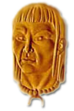

# Cacique Arichuna

>Este guerrero perteneció a la tribu de Los Jiraharas, ubicando su radio de acción, en la región de lo que hoy se conoce como Lara y parte de Yaracuy.

Se forma bajo las órdenes del Cacique Queipa y cuando este muere, es seleccionado para comandar la tribu con el rango de cacique, lucha contra los españoles colonizadores y contra otras tribus enemigas dirigidas por el Cacique Guaratarí.

El Cacique Arichuna acepta la paz y se dedica al comercio de especias con los españoles, su amigo Juan Fernández, hombre de buenos sentimientos, es acusado por el tribunal inquisidor y condenado a muerte. Arichuna no está conforme con la sentencia y busca interceder por el.

El Gobernador Juan de Leiva no quiso meterse en el asunto, entonces el Indio Arichuna decide a finales del año de 1556, atacar la prisión en Valencia, logra la libertad de Juan Fernández y lo lleva a su tribu.

Un tiempo después, Juan Fernández obtiene el perdón, pero nunca quiso abandonar la tribu en agradecimiento al Cacique Arichuna.

