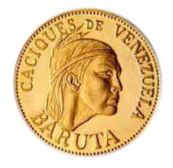

# Cacique Baruta

>El Cacique Baruta fue Mariche (nombre de una tribu de Venezuela que vivieron en lo que hoy es la zona de Filas de Mariche), es hijo del Gran Cacique Guaicaipuro y de Urquia. Su nombre proviene del nombre dado por los mariches al jabillo.

El Cacique Baruta, en el Siglo XVI forma parte de la coalición dirigida por su padre el Cacique Guaicaipuro y posteriormente por el Cacique Tamanaco, contra los colonizadores españoles.

Al morir su padre, Baruta recibe de su madre el penacho con plumas rojas que había usado el Cacique Guaicaipuro como símbolo de linaje y mando. El Cacique Baruta no solo atacaba al enemigo, también establecía pactos y alianzas con otras tribus rebeldes, y obtenía grandes victorias.

El fundador de Caracas, Diego de Losada, otorga en encomienda a Alonso Andrea de Ledesma, al Cacique Baruta, su tribu y sus tierras, hay dos versiones sobre lo que paso; una de ellas, es que Baruta y dos mil indios de su tribu presentaron batalla y perdieron, y la otra, es que Baruta decidió aceptar pacíficamente la presencia de los españoles, estos respetaron su autoridad y sus tradiciones, además cooperaron con Baruta, enseñándoles nuevas técnicas de ganadería y de cultivos.

Al morir el Cacique Baruta, es enterrado con su rito. El 19 de agosto de 1620, el Gobernador Francisco de La Hoz Berríos, funda Baruta en honor al Cacique con el nombre de San Francisco de Paula de Baruta.

Los textos hacen referencia al nombre Baruta, en la consagración de la Iglesia de la Villa de Nuestra Señora del Rosario de Baruta el 14 de julio de 1655.

