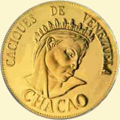

# Cacique Chacao

>El Cacique Chacao de raza caribe, era un indio venezolano de mediados del Siglo XVI, llamado el Hércules Americano, gobernó en la región caraqueña que hoy lleva su nombre. El nombre Chacao deriva de Chacau, que significa arena, los Tamanacos decían Ciaccau y los Caribes Saccao.

El Indio Chacao era de gran tamaño, tenía audacia y una capacidad muy especial para preparar ataques tipo comando, era muy respetado por los conquistadores españoles que le temían y respetaban por su condición de valiente e implacable. Su cacicazgo lo ejerció con sentido democrático y no tiene ninguna injusticia contra su gente. 

Su territorio lo defendió con pasión, se alió con el Cacique Guaicaipuro y participó en la coalición de jefes que durante varios años mantuvieron el control del Valle de los Caracas y la región montañosa de los Indios Teques. 

En el año de 1567, el Indio Chacao se enfrenta a un oficial de Diego de Losada, a Juan de Gámez, este lo envía a prisión. Luego Diego de Losada, decide dialogar con Chacao y el Indio recobra su libertad. En 1568 renueva su alianza con el Cacique Guaicaipuro y con sus hombres acude al sitio de Maracapana.

Conocido por ayudar a los débiles, especialmente a los niños y mujeres, se entera que el Capitán Catado había secuestrado a dos pequeños indios y los tenía esclavizados, juró rescatarlos, y devolverlos sanos y salvos a su familia. 

El Cacique Chacao fue a rescatar a los niños, entró con gran destreza al campamento español y los liberó, pero fue herido de muerte, desplomándose sobre la tierra. Su muerte causó un profundo dolor en su pueblo.

