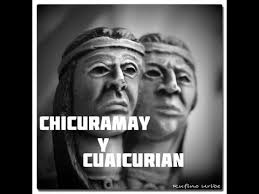

# Cacique Chicuramay

>Chicuramay - Cuaicurián Chicuramay fue uno de los veintitrés caciques que fueron condenados a muerte después de la desaparición de Guaicaipuro, por una cruel decisión de la Alcaldía de Caracas, que deseaba alcanzar rápidamente la pacificación del valle. El alcalde los hizo aprisionar, los juzgó sin pruebas y los condenó a muerte.

Chicuramay era un cacique muy joven, valiente y amado por su gente, lo que motivó que uno de sus guerreros, el bravo Cuaicurián, se presentara a los jueces, que eran Pedro Ponce de León y Martín Fernández de Antequera y les afirmara que estaban en un error y que el verdadero cacique Chicuramay era él. Sorprendidos los dos funcionarios por la aseveración, procedieron a interrogarlo y quedaron convencidos, ya que Cuaicurián era un joven fuerte con dotes de mando y con conocimientos de las operaciones de su tribu. 

Cuando Chicuramay recibió la noticia de que estaba en libertad, no imaginó nunca la dolorosa razón que la causaba. Cuaicurián fue torturado por indios mercenarios, al igual que los otros 22 caciques, y al despuntar el alba fue salvajemente asesinado. Era el año 1569. Chicuramay tembló de ira al saber toda la verdad y buscó venganza. Averiguó que el asesino había sido un hombre de apellido Portolés, que trabajaba como asistente de Fernández de Antequera y le quitó la vida.

Cacique Chicuramay fue en el año 1569 cuando tras la muerte de Guaicaipuro Chicuramay es apresado y condenado a muerte por Pedro Ponce de León y Martín Fernández de Antequera bajo el mando de la Alcaldía de Caracas.  Chicuramay era Cacique de la   Zona Central desde Mariches hasta Barlovento y era muy amado por su tribu por sus dotes de justicia y equidad a pesar de ser un cacique Jóven.

Al ser condenado a muerte la noticia llega a su tribu y ante el dolor que produce la noticia el guerrero Cuaicurián decide engañar a los españoles y dar su vida a cambio de la del recio Cacique.

Chicuramay es entonces liberado sin saber lo que Cuaicurián había hecho!… su indignación y dolor lo hizo buscar al brazo ejecutor de la muerte y tortura de su amigo para vengarlo. Chicuramay mata a Portolés (asistente de Martín Fernández de Antequera) en venganza por lo sucedido y emprende nuevamente la heróica lucha contra los españoles.
