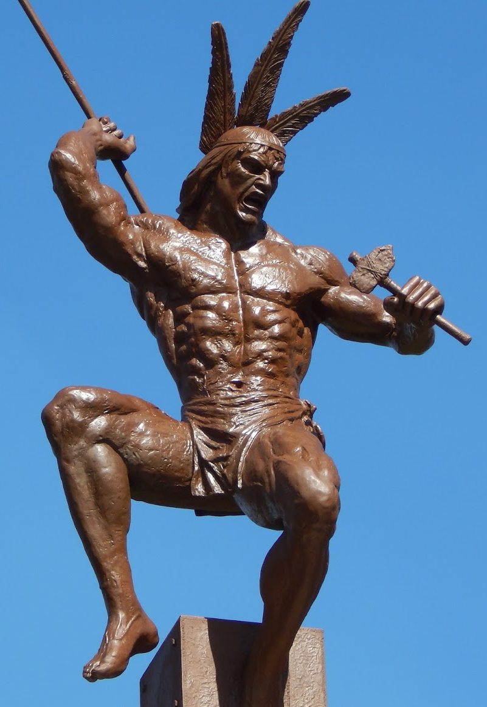

# Cacique Guaicaipuro

>Es conocido actualmente como Guaicaipuro, pero en documentos de la época se le encuentra con el nombre de Guacaipuro II. Es uno de los Caciques más famosos e ilustres de Venezuela.

El Cacique Guaicaipuro nació en Caracas en el año de 1530. Fue un Cacique Guerrero de la confianza del Cacique Catuche, asume el cacicazgo cuando tenía 20 años.

El área que actualmente ocupa la Ciudad de Los Teques, fue poblada por varios grupos indígenas, los cuales contaban cada uno con su propio cacique. La tribu de Guaicaipuro, era una de las más grandes, uno de sus hijos, Baruta, se convirtió en Cacique y dominaba el área del actual municipio.

Hacia el año de 1560, los españoles descubren el oro en el área de Los Teques y comienzan a poblar el sitio para extraerlo, el Cacique Guaicaipuro ve sus tierras invadidas y junto a otros caciques aliados, como Terepaima, atacan a los españoles y los obligan a abandonar el lugar.

En 1561, el gobernador de la provincia de Venezuela, Pablo del Collado envió a Juan Rodríguez Suárez para pacificar el área, y vence al Cacique de los Teques en las Batallas de San Pedro y La Quebrada, creyendo que había repelido a Guaicaipuro de la zona, deja algunos mineros y tres de sus hijos. Una vez que los soldados españoles se marchan del lugar, Guaicaipuro toma de nuevo las minas y liquida a todos los trabajadores, como a los tres hijos de Rodríguez Suárez.

Rodríguez Suárez que estaba en camino a la ciudad de Valencia, con el propósito de reunirse con los españoles leales al rey, fue muerto por Guaicaipuro y el Cacique Terepaima durante su trayecto a Valencia.

En enero de 1562, Guaicaipuro y Terepaima enfrentan y matan al Capitán Luis de Narváez. Guaicaipuro convoca una alianza estratégica de todos los caciques de la región, aceptando los Caciques de Aramaipuro, Baruta, Chacao, Chicuramay, Guaicamacuto, Naiguatá, Paramaconi y Terepaima.

Durante años la alianza fue triunfadora, pero en el año 1568 pierde la Batalla en Maracapana, esta batalla fue liderada por Guaicaipuro, comandada por Tiuna y la participación de todas las tribus aliadas. Derrotados por el ejército español comandado por Diego de Losada, la coalición se disuelve y los jefes regresan a sus tierras.

Guaicaipuro se refugia en Suruapo y ataca a Diego de Losada, esté ordena al Alcalde Francisco Infante que ataque a Guaicaipuro en el propio lugar de Suruapo. Francisco Infante consigue indios pacificados y fieles a España que conocían como llegar a la vivienda del cacique. Guaicaipuro toma su espada y mata a los que lo atacaron, se resguarda en su choza, pero los españoles le prenden fuego y le piden que se rinda, el cacique no acepta y prefiere morir atrapado por las llamas.

El 8 de diciembre de 2001, los restos simbólicos del Cacique Guaicaipuro (sus restos nunca fueron encontrados) fueron trasladados al Panteón Nacional.
