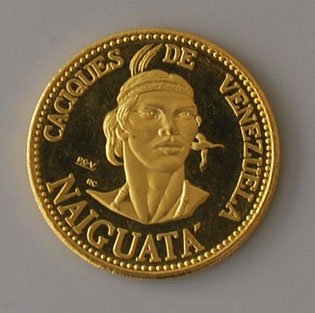

# Cacique Naiguatá

>El Cacique amigo de las gaviotas. Era un cacique de la familia Caribe, aguerrido, fuerte, romántico y tenía un gran amor por las gaviotas. Ejerció sus dominios a lo largo de la zona costera desde el Río Anare, pasando por Chichiriviche, hasta la región costeña hoy conocida como Puerto La Cruz.

Los españoles colonizadores comandados por el capitán Rodríguez Suárez, llegaron a las tierras del Cacique Naiguatá, este los recibió con grandes demostraciones de hospitalidad, ofreciéndoles maíz, yuca y pescado. Teniéndolos como huéspedes, un soldado disparó su arcabuz contra una gaviota y la mató, hecho que enfadó al Indio Naiguatá, exigiendo la ejecución del agresor, pero el capitán Rodríguez Suárez se niega. 

Naiguatá, toma por asalto el campamento de los soldados y somete a sentencia al soldado, cuando le iba a dar muerte al soldado, una bandada de gaviotas hizo acto de presencia, el Cacique Naiguatá interpretó esto, como el perdón de las gaviotas hacia el agresor y lo libera.

Naiguatá vivió por muchos años y conoció muchos de los cambios culturales que impuso la colonización.

El Naiguatá es el pico más elevado de la Cordillera de la Costa. En sus faldas se asienta Caracas, la capital de Venezuela. Recibe también este nombre un pueblito en el Litoral Central, donde todos los miércoles de Ceniza se celebra el “Entierro de la Sardina”, fiesta popular en la que se combinan el baile, la música, las representaciones teatrales y la poesía. Tanto el pico como el pueblo, tomaron su nombre en honor al aguerrido cacique Naiguatá, quien tenía verdadero amor por las gaviotas y cuyos vastos dominios comenzaban en los márgenes del río Anare —voz típicamente caribe— y alcanzaban, al pasar por Chichiriviche, hasta la región costeña hoy conocida como Puerto de la Cruz.

Aguerrido, fuerte y en cierta manera romántico. Como rasgo curioso de su espíritu tenía verdadero amor por las gaviotas, por esto Naiguatá pasaba horas y horas contemplando embelesado a dichas aves, hoy desaparecidas del litoral guaireño. 

Debido a que según las leyendas indígenas el cacique tenía poderes sobrenaturales, podía interpretar los ocultos mensajes de sus vuelos. 

:::info 
Dicen las crónicas que cuando los españoles comandados por el capitán Rodríguez Suárez llegaron a sus tierras, Naiguatá los recibió con grandes demostraciones de hospitalidad, ofreciéndoles yuca, maíz y pescado. Un día sin embargo, uno de los soldados españoles disparó su arcabuz contra una gaviota y la mató. Al enterarse del hecho, Naiguatá se enfadó y exigió que le entregaran de inmediato al culpable para sacrificarlo en inmediato desagravio a la belleza y al poder esotérico de esas aves, pero como Rodríguez Suárez se negó a entregarlo, el cacique “amigo de las gaviotas” atacó en la noche su campamento e hizo prisioneros a todos los españoles. Cuando averiguó quién era el que había disparado a la gaviota, lo mantuvo como su prisionero y expulsó de sus dominios a los demás extranjeros. 

Encontrándose a punto de ajusticiar al soldado, una bandada de gaviotas sobrevoló el lugar. Naiguatá que sabía interpretar sus mensajes, comprendió que las aves habían venido a otorgarle su perdón al prisionero. Por tal motivo, el también lo perdonó y lo dejó ir tras advertirle que nunca más matara o maltratara una gaviota.
:::
