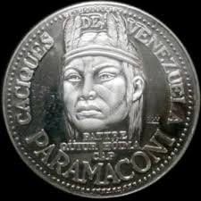

# Cacique Paramaconi

>Paramaconi puede ser considerado el indio  de la pacificación.

Los españoles lo llamaban el "Cacique-Caballero" pero el significado de su nombre es "Caimán Pequeño".

Su origen cumanagoto lo ubica en la raza caribe. Habitaba en la zona centro-norte-costera del país.

Se unió a Guaicaipuro al iniciarse la década de los sesenta y presentó dura oposición a las tropas invasoras. Formando parte de las tropas del Cacique Guaicaipuro, tubo muchos enfrentamientos con los españoles donde salía victorioso en batalla. 

Cacique de los Toromaimas, principal aliado de Guaicaipuro en repetidos combates para expulsar a los intrusos que trataban de usurpar sus tierras, sus mujeres y esclavizar a los hombres, jóvenes y adultos de las tribus vencidas. 

Junto con el jefe Teque y los temerarios caciques Chacao, Tamanaco, Guaicoco, Carapaica, Epoima, Conoropa y otros, asaltó y destruyó en ausencia de Rodríguez Suárez la reedificada ciudad de San Francisco, matando a flechazos a varios de sus moradores, espantando el ganado y caballos, de manera que al retornar el Conquistador, encontró desolación y un reguero de cadáveres. 

Fueron pocos sobrevivientes a salvo en la espesura. El escenario, provocó un viaje urgente de Rodríguez a solicitar auxilio a Fajardo, Justicia Mayor de la Villa del Collado –en el litoral- dejando en trinchera, con poca gente y escaso ganado recuperado al capitán Julián Mendoza. 

En 1561 Guaicaipuro atacó las minas de la región de Los Teques, en donde murieron todos los españoles, incluyendo los hijos de Rodríguez Suárez y Paramaconi también arrasó con sus guerreros la Villa San Francisco, levantada por Rodríguez, en el mismo lugar donde Losada fundará a Caracas seis años más tarde. Cuando ya tenía ganada la batalla, ocurrió que una estampida de ganado destrozó a sus bravos toromainas y se vio obligado a retirarse.

No tardó Paramaconi en retirar sus ataques, encontrando fuerte resistencia de los castellanos guarnecidos en los corrales. Estaban en trance de huir cuando ‘el ganado asustado con el estruendo de la lucha rompió el cercado y en su rápida fuga diseminó a los agresores, incidente aprovechado por los españoles, para desperdigar a los enemigos’. Antes había desbandado a los habitantes de la Villa del Collado.

Paramaconi arrasó con sus guerreros en la Villa San Francisco, el mismo lugar donde se fundaría caracas 6 años mas tarde. 

Paramaconi atacó más tarde, unido a la coalición de caciques, el sitio del Collado (hoy Caraballeda) en donde vencieron a Fajardo y éste se retiró a Margarita con sus hombres.

En 1567 llegó Diego de Losada y realizó la fundación de Caracas. En 1568 concurre a la gran coalición convocada por el gran jefe Guaicaipuro, pero la operación no tuvo éxito. 

A comienzos de 1570, Garcí González decidió exterminar al enemigo y lo atacó de noche en su caney. Paramaconi en la lucha fue herido y González le mando a curar las heridas y a partir de ese momento hubo paz entre ambos hombres y fueron amigos.

Es por este motivo que Paramaconi se considera el indio de la paz sin dejar atrás su valentía y grandes hazañas como guerrero libertador de su pueblo.

Al morir Guaicaipuro en atrevida defensa de su vida y de su gesta, en el palenque de el Vigía –hoy barrio de la ciudad de Los Teques- Paramaconi, de manera sostenida, mantuvo en jaque a Losada y demás acompañantes. 

La destitución de Losada (1569) a causa de intrigas y envidias, dejó indefensa la ciudad, porque con él salieron muchos de sus acompañantes, y los pocos residentes tuvieron que pedir ayuda (1570) a Garcí González de Silva, quien pronto se hizo presente en la recién fundada población. 

En el intervalo, Paramaconi en sucesivos asaltos debilitó el poblado, y Caracas pudo reactivar su existencia con el oportuno socorro del capitán González, repeliendo al tenaz enemigo, hasta en sus propios terrenos, y nos relata Mac Pherson, el encuentro final al salir las aguas de septiembre (1570): 

>_"Los alcaldes de Caracas le confiaron la tarea de apresar al cacique, y Garcí, con 30 de sus soldados y algunos baquianos, una noche con el mayor sigilo, sorprendió en sitio agreste y solitario al gallardo Paramaconi y su hueste. Trabóse allí una lucha heroica por parte de los dos adversarios, pero Paramaconi, resbaló cayendo en una hondonada, tras él se lanzó el contendor y en lucha cuerpo a cuerpo, donde el cacique quedó mal herido al recibir dos estocadas del español, fue atado y llevado a Caracas, donde, según los más conocedores del tema, recibío la saturación de los daños, y luego se le permitió regresar a su tribu. En los libros consultados, aparecen dos versiones: una, que meses después del suceso, por decisión de González, volvió cabizbajo a sus predio; la otra, que en manifestación de gratitud, prometió desguarnecer a sus flecheros y dedicar sus años restantes al reposo en el campo y a la caza. No hay rastros de actividades posteriores ni de su muerte, aunque abundan las leyendas producto de afectivas motivaciones localistas distantes de la historia.”_
