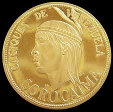

# Cacique Sorocaima

>El nombre del Cacique Sorocaima significa: _"Pájaro de vistoso plumaje"_.

Era un hombre rígido, severo y reservado, según las versiones de los historiadores, era de la tribu de los Teques.

Fue un hombre de confianza del Gran Cacique Guaicaipuro, se forma bajo los cánones de la escuela espartana, la misma en la cual se formó Guaicaipuro. 

Al morir el Cacique Guaicaipuro queda como jefe guerrero bajo el mando del Cacique Conopaima. Uno de sus más aguerridos guerreros y líder de tropas indígenas.

En el año de 1570, bajo el mando del Cacique Conopaima y el Cacique Terepaima, participa en los ataques contra la recién fundada Santiago de León de Caracas, bajo el mando de Conopaima y Terepaima. 

En 1572, Garcí González de Silva apresa al Cacique Sorocaima, el Cacique Conopaima seguía peleando y resistiendo. 

Ante estos hechos y deseoso de  terminar la batalla rápidamente, González de Silva decide utilizar a Sorocaima como carnada y dice en voz alta,para que lo escuchen los otros guerreros: _"El jefe Indio Sorocaima perderá su mano derecha, que le sería amputada, a menos que se rindan y en este último caso, se perdonaría la vida a todos"_. 

Es allí cuando el Jefe Sorocaima, le dice a los guerreros: _"Ataquen con fuerza, mis valientes, que los españoles no tienen mucha gente."_

Y luego y sin vacilar, estira el brazo para que le corten la mano derecha, lo cual fue llevado a cabo por los oficiales al servicio de Garcí González. 

Sorocaima, en un gesto que reflejaba por igual el valor y la grandeza de su raza, tomó con su mano izquierda la derecha y, levantándola la ondeó en señal de triunfo. Luego, avanzó hacia sus hombres. 

Garcí González ordena su libertad, Sin embargo, al dar la espalda Sorocaima al enemigo, uno de los soldados le disparó a traición, quitándole la vida.
