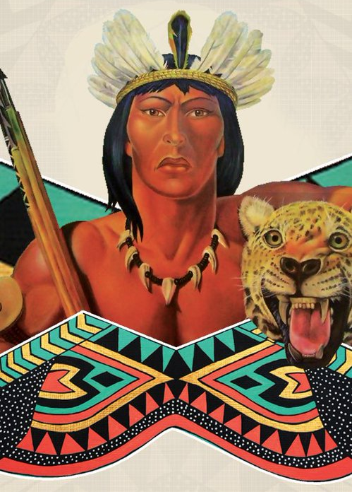

# Cacique Tamanaco

>El 5 de julio de 1573 es asesinado este guerrero Caribe, quien lideró la feroz resistencia indígena contra la conquista y barbarie del imperialismo español en el valle de Caracas. Su muerte, lejos de aniquilar el espíritu combativo de las tribus, los impulsó a radicalizar sus acciones sin temer por su destino.

Dos años después de la muerte del Gran Cacique Guaicaipuro, surge el Cacique Tamanaco, cacique de los Indios Mariches y de Los Quiriquires. Su misión fue propiciar la alianza entre las diferentes Tribus Caribes.

El Cacique Tamanaco, lideró durante gran parte del Siglo XVI la resistencia contra la conquista española, especialmente en la zona central del país.

La recién fundada Ciudad de Santiago de León de Caracas en 1567, era constantemente atacada por las tribus locales. El 5 de diciembre de 1570, Diego de Mazariegos toma cargo como gobernador de la provincia de Venezuela y da prioridad a la pacificación de los territorios. 

Para el año de 1573, el Cacique Tamanaco y sus aliados se vuelven problemáticos para los conquistadores, y tienen que venir refuerzos de España y otras islas españolas en el Caribe para controlarlos. Luego el capitán Pedro Alonso Galeas y el teniente Francisco Calderón se unen con el fin de atrapar a Tamanaco y sus hombres, entran en tratos con el Cacique Tapiaracay, enemigo de Tamanaco y del pacificado Cacique Aricabuto, quien le ofrece ayuda a cambio de que le entregue a este último, el trato no se consolida. Tamanaco conoce que lo quieren atrapar y prepara una fuerza de 300 guerreros más la ayuda de las tribus Arbaco y Teques. Se enfrentan pero el combate no tuvo vencedor. 

Tamanaco decide atacar Caracas y persigue a los soldados españoles liderados por el capitán Hernando de la Cerda hasta el Río Guaire, combatieron, pero los indios no advirtieron la llegada de una caballería española, y el Cacique Tamanaco y sus hombres son atrapados y hechos prisioneros.

Tamanaco es sentenciado a la horca, pero Garcí González, a cargo de la ciudad de Caracas, no estuvo de acuerdo con la sentencia y discutiendo con el capitán Mendoza, le proponen a Tamanaco, la horca o luchar contra el perro entrenado de Mendoza que irónicamente se llamaba "Amigo". Tamanaco acepta, es desatado y colocado en la Plaza Mayor (hoy Plaza Bolívar), sueltan al perro, pero la lucha era desigual y Tamanaco muere por las mordeduras.
