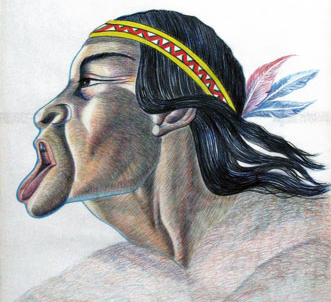

# Cacique Terepaima

>Terepaima significa: “Río que corre en el Valle”.

Terepaima fue un guerrero muy hábil que hizo justicia en contra de los conquistadores. 

El aspiraba al título de Cacique, pero este se le había negado. 

Sin embargo, vengó la muerte del Cacique Yoraco dando muerte a Rodríguez Suarez que hizo tantos estragos en la población indígena. 

Terepaima hizo todo esto sin haber obtenido aún el título de Cacique, hasta que estas proezas le adjudican el título convirtiéndose en cacique de los Araucos y los Meregotos.

También impidió la entrada a Luis Narvaez a sus dominios al vencerlo en 1561. Ni siquiera Losada logra vencer al guerrero.

A este punto encontramos dos corrientes históricas:

Una que admite que Terepaima es engañado finalmente por Garcí Gonzalez de Silva quién en uno de sus encuentros para una supuesta paz es traicionado y muerto por la espalda.

La otra nos dice que si bien Terepaima se encontró con Garcí Gonzalez de Silva, este no pudo engañarlo por lo que Terepaima sale ileso para seguir luchando en contra de los españoles. 

Según esta última versión Terepaima muere en guerra, peleando en contra de los conquistadores casi en 1575.
