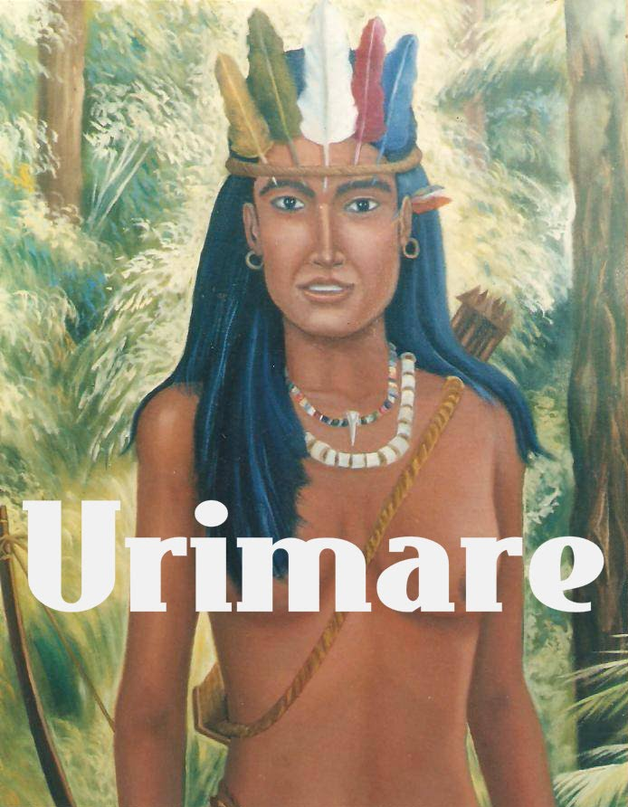

# Cacique Urimare

>Urimare (1era mujer Cacique de nuestro pais): hija del  Cacique Aramaipuro quien la crió enseñándole estrategias para defenderse y defender a su pueblo.

Es secuestrada por Sir Walter Raleigh quien luego de matar a Aramaipuro, se lleva a Urimare como trofeo. 

Urimare logra después de un tiempo escapar lanzándose de la embarcación Pirata y nadando hasta tierra firme. 

Esta es una de las tantas acciones aguerridas de esta fiera mujer que logró sobrevivir en un acto que fácilmente le hubiese causado la muerte. 

Al llegar a las costas, es atrapada por los españoles y esclavizada por un tiempo hasta que uno de los soldados españoles, empeñado en despojar a Urimare de su dignidad, decide violarla. Urimare le da muerte inmediatamente y logra escapar. 

En su escapatoria llega hasta los designios del Gran Cacique Guaicamacuto quien la ayuda y protege adoptándola como una hija. 

Incluso, gracias a las dotes e inteligencia de Urimare, le otorga poder ante la tribu hasta tal punto que se convierte en la 1era mujer Cacique de nuestro pais. 

Da lucha aguerrida y enfrenta a los españoles hasta que Guaicamacuto hace el tratado de paz y ella lo acata por respeto a su padre adoptivo.

