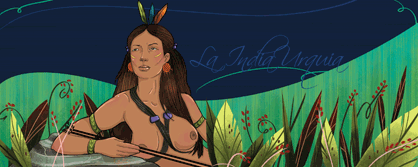

# Cacique Urquia

>Urquía su nombre significa Ojos de Águila, pertenecía a la etnia de los Teques. Guerrera, cacica con el prototipo de mujer amazónica. Fue la esposa de Guaicaipuro, Madre de Baruta y de los hijos de Guaicaipuro.

Guaicaipuro consiguió el Cacicazgo tras la muerte de Catuche, con tan solo 20 años de edad. Como parte de las celebraciones por la toma de mando, el piache mando a reunir 200 doncellas, pero Guaicaipuro estaba enamorado de Urquía, una hermosa india de cabellos negros trenzados  y ojos de un negro profundo y penetrante… sus labios de color rosa cautivaron al joven cacique que sin vacilar le dijo al Piache: _“MI URQUÍA VALE POR TODAS”_.

Con la llegada de los españoles, con armas y con violencia, alteró el rumbo de la vida de todos los habitantes de la región. Guaicaipuro en calidad de jefe convocó a todas las comunidades de su circunscripción, quienes respondieron al llamado de inmediato. 

Entre las delegaciones llegaba Urquía, en un bello palanquín, cargado sobre los hombros de dos indígenas. “Ella no pudo resignarse a permanecer en el bohío de los teques sintiendo pasar las horas, cuando su compañero adorado andaba en fatigas y angustiado por la patria, por ella y por sus hijos”.

Desde entonces la princesa combatió junto a su pueblo, se mantuvo a la ofensiva, atacando al enemigo, incentivando la unión de las diferentes tribus y promoviendo la resistencia indígena.

Después de la muerte del gran cacique a manos de los españoles en 1568, a Urquía le correspondió el honor de investir a su hijo Baruta como Cacique:

>_“Sean estas tres plumas rojas el símbolo de la sangre de tu padre y de tu pueblo, que ha sido derramada por el invasor que viene a arrebatarnos nuestra tierra. Defiéndelas con honor”._

